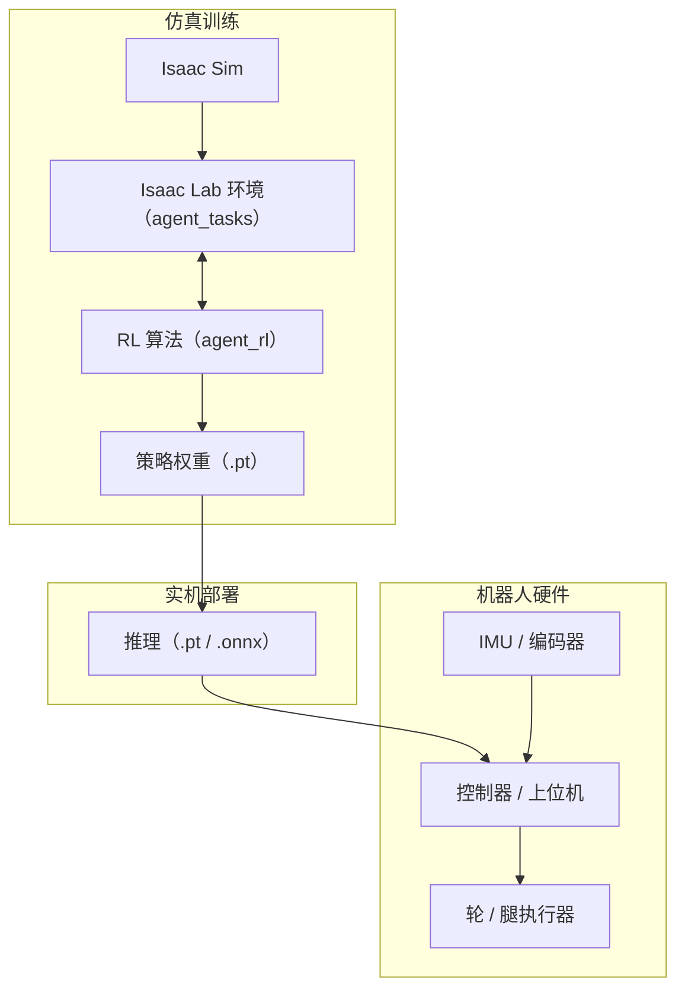
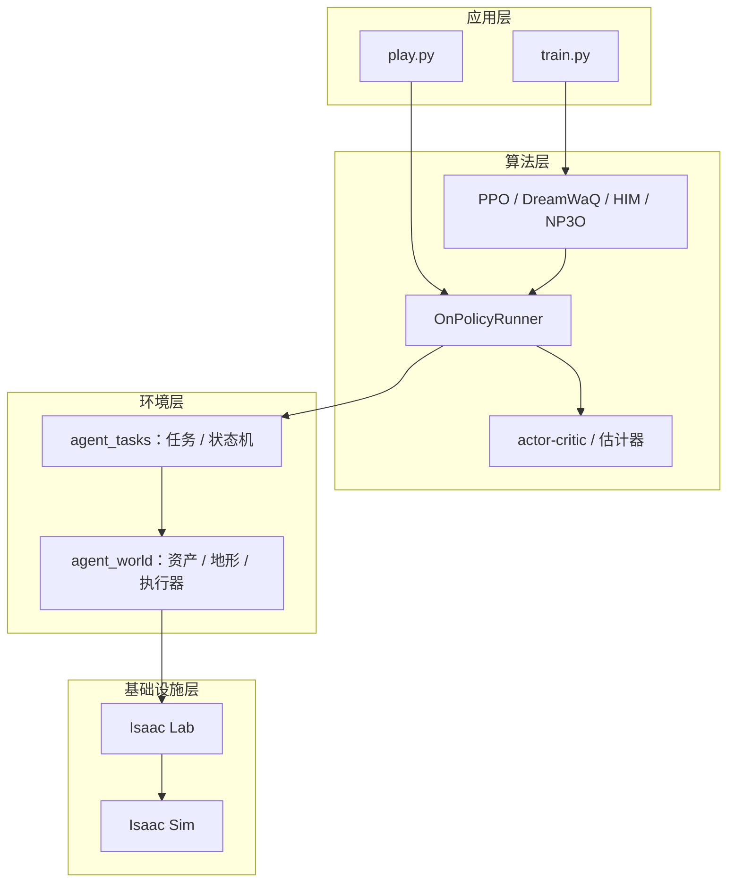

# wheeled-legged_RL

26 赛季轮腿步兵强化学习训练仓库。基于 **Isaac Sim + Isaac Lab + RSL-RL** 的轮腿（wheelbipe）机器人强化学习训练代码。

包含：

- **任务**：Wheelbipe V14 系列平地 / 粗糙地形任务（含 Play 配置）
- **算法**：普通 PPO、[DreamWaQ](https://github.com/Manaro-Alpha/DreamWaQ)、HIMLoco（HIM）、NP3O（BarlowTwins）
- **状态机**：腾空-落地状态机（airborne / jump_takeoff / step_up / stair）、小陀螺平移模式
- **脚本**：训练、play（键盘控制 / 实时可视化 / 速度轨迹录制）、环境列表
- **预训练模型**：`pretrained/` 下的示例权重

## Features

本软件面向轮腿（wheelbipe）机器人的强化学习训练与部署，主要功能：

- **多任务训练**：Wheelbipe V14 系列平地 / 粗糙地形训练与 Play 任务（见 [Available Tasks](#available-tasks)）。
- **多种 RL 算法**：内置 PPO、DreamWaQ（隐式地形想象）、HIMLoco（历史轨迹估计）、NP3O（BarlowTwins + 安全约束）。
- **状态机**：腾空-落地状态机（airborne / jump_takeoff / step_up / stair）与小陀螺平移模式。
- **训练 / 推理脚本**：一键训练（`train.py`）、键盘控制 play（`play.py --keyboard`）、实时可视化（`--plot`）。
- **效果分析**：速度 / reward 轨迹录制，导出 CSV 与交互式 HTML。
- **部署导出**：策略导出为 TorchScript（`.pt`）/ ONNX，便于实机部署。
- **预训练模型**：`pretrained/` 下提供示例权重。

## Environment & Dependencies

### 软件环境

| 环境 | 版本 |
| --- | --- |
| Ubuntu 22.04 | Isaac Sim 4.5 / Isaac Lab 2.1.0 |
| Ubuntu 24.04 | Isaac Sim 5.1 / Isaac Lab 2.3.x |
| Python | 3.11 |
| PyTorch | 2.7.0+cu128 |
| CUDA | 12.8 |

### 硬件环境（实测）

| 硬件 | 规格 |
| --- | --- |
| GPU | NVIDIA GeForce RTX 5070 Ti（16 GB 显存） |
| CPU | AMD Ryzen 5 9600X |

> 最低要求：支持 CUDA 的 NVIDIA GPU（≥ 8 GB 显存）。

### 依赖仓库

- [Isaac Lab](https://github.com/isaac-sim/IsaacLab)
- [RSL-RL](https://github.com/leggedrobotics/rsl_rl)
- 本仓库 `source/agent_world`、`source/agent_tasks`、`source/agent_rl`（可编辑安装）

## Installations

### 1. Isaac Sim

- [Workstation Installation](https://docs.isaacsim.omniverse.nvidia.com/5.1.0/installation/install_workstation.html)（推荐）

### 2. Isaac Lab

- [Installation using Isaac Sim Pre-built Binaries](https://isaac-sim.github.io/IsaacLab/main/source/setup/installation/binaries_installation.html)

建议先浏览 Isaac Lab 官方教程。

### 3. Repo Installation

建议在 conda 环境中安装，运行仓库脚本 / 导入模块 / 排查依赖前先 `conda activate <env>`。

```bash
python -m pip install -e source/agent_world -i https://pypi.tuna.tsinghua.edu.cn/simple
python -m pip install -e source/agent_tasks -i https://pypi.tuna.tsinghua.edu.cn/simple
python -m pip install -e source/agent_rl -i https://pypi.tuna.tsinghua.edu.cn/simple
```

> **注意**：`env.py` 内部会 `import scripts.utils.velocity_trace_html`，因此请在**仓库根目录**下运行脚本（或把仓库根目录加入 `PYTHONPATH`），否则会报 `ModuleNotFoundError: No module named 'scripts'`。

## Usage

### List RL tasks

```bash
python scripts/list_envs.py
```

### Environment visualisation

```bash
python scripts/view_robot.py --task=<task_name> --num_envs=1 --device=cpu

# V14 rough play 可视化
python scripts/view_robot.py --task=Robotics-Wheelbipe-V14-Rough-Play-v0 --num_envs=1
```

### Train

```bash
python scripts/rsl_rl/train.py --task=<task_name> --num_envs=4096 --max_iterations=20000 --device=cuda:0 --headless
```

### Play

```bash
# 基础模式
python scripts/rsl_rl/play.py --task=<task_name> --num_envs=16 --checkpoint=<model_path>

# 键盘控制（W/S/A/D 控制，Z/X 调高度，Q 触发跳跃）
python scripts/rsl_rl/play.py --task=<task_name> --num_envs=1 --checkpoint=<model_path> --keyboard

# 实时数据可视化（需要 matplotlib）
python scripts/rsl_rl/play.py --task=<task_name> --num_envs=1 --checkpoint=<model_path> --keyboard --plot

# V14 rough play 推荐查看命令
python scripts/rsl_rl/play.py --task=Robotics-Wheelbipe-V14-Rough-Play-v0 --num_envs=1 --checkpoint=<model_path> --keyboard
```

### Record V14 rough speed/reward curves

`WheelbipeV14RoughEnvCfg_v1_Play` 中已启用 `velocity_trace_cfg`，会在 play 时自动选择指定地形中的一个 agent，记录速度、高度和当前配置下的 reward contribution，并导出 CSV 与交互式 HTML。

```bash
# 录制 10s 速度轨迹；环境步长为 0.02s，因此 10s 对应 --max_steps=500
python scripts/rsl_rl/play.py \
  --task=Robotics-Wheelbipe-V14-Rough-Play-v1 \
  --num_envs=64 \
  --checkpoint=<model_path> \
  --device=cuda:0 \
  --headless \
  --max_steps=500
```

输出文件默认在 `logs/debug/` 下，文件名自动带时间戳和 pid：

```text
logs/debug/rough_v1_play_velocity_trace_<timestamp>_pid<pid>.csv
logs/debug/rough_v1_play_velocity_trace_<timestamp>_pid<pid>.html
```

记录列包括：

- 基础信息：`sim_time_s`、`episode_time_s`、`env_id`、`terrain`、`airborne`
- 速度：`cmd_x/cmd_y/cmd_yaw`、`vel_x_b/vel_y_b/yaw_rate_b`
- 高度：`height_cmd`、`height_obs`、`height_relative`、`height_reward_ref`
- reward：`reward_total` 和所有 `reward_<term>` 列

HTML 会把速度/角速度、高度和 reward heatmap 分成三块展示；鼠标 hover 联动所有图表。也可以从 CSV 离线重新导出：

```bash
python scripts/utils/export_velocity_trace_html.py \
  logs/debug/rough_v1_play_velocity_trace_<timestamp>_pid<pid>.csv
```

高度观测可选裁剪，默认关闭，配置项为 `height_obs_clip_enabled` 和 `height_obs_clip_range`。更多实现说明见 `scripts/utils/velocity_trace_html.py` 与 `WheelbipeV14RoughEnvCfg_v1_Play.velocity_trace_cfg`。

## Available Tasks

| 任务 | 说明 |
| --- | --- |
| `Robotics-Wheelbipe-V14-Flat-v0` | 平地 PPO |
| `Robotics-Wheelbipe-V14-Flat-v1` | 平地 PPO + 落地预训练 |
| `Robotics-Wheelbipe-V14-Flat-v2` | 平地 PPO + 小陀螺平移 |
| `Robotics-Wheelbipe-V14-Flat-Play-v0` | 平地 PPO Play |
| `Robotics-Wheelbipe-V14-Flat-Play-v2` | 平地 PPO + 小陀螺平移 Play |
| `Robotics-Wheelbipe-V14-Rough-v0` | 粗糙地形 PPO + 小陀螺 |
| `Robotics-Wheelbipe-V14-Rough-v1` | 粗糙地形 PPO + 跑场 |
| `Robotics-Wheelbipe-V14-Rough-Play-v0` | 粗糙地形 PPO + 小陀螺 Play |
| `Robotics-Wheelbipe-V14-Rough-Play-v1` | 粗糙地形 PPO + 跑场 Play |
| `Robotics-Wheelbipe-V14-Flat-DreamWaQ-v0` | 平地 DreamWaQ |
| `Robotics-Wheelbipe-V14-Flat-DreamWaQ-Play-v0` | 平地 DreamWaQ Play |
| `Robotics-Wheelbipe-V14-Flat-HIM-v0` | 平地 HIMLoco（HIM） |
| `Robotics-Wheelbipe-V14-Flat-HIM-Play-v0` | 平地 HIMLoco Play |
| `Robotics-Wheelbipe-V14-Flat-NP3OBarlow-v0` | 平地 NP3O（BarlowTwins） |
| `Robotics-Wheelbipe-V14-Flat-NP3OBarlow-Play-v0` | 平地 NP3O Play |

## Algorithms

- **PPO**（common）：`source/agent_rl/agent_rl/rsl_rl/`
- **DreamWaQ**：`algorithms/ppo_dreamwaq.py` + `modules/actor_critic_dreamwaq.py` + `runners/on_policy_runner_dreamwaq.py`
- **HIMLoco（HIM）**：`algorithms/ppo_him.py` + `modules/actor_critic_him.py` + `modules/him_estimator.py`
- **NP3O（BarlowTwins）**：`algorithms/np3o.py` + `modules/actor_critic_balowtwins.py`

## State Machines

位于 `source/agent_tasks/agent_tasks/direct/wheelbipe/state_machines/`，由 `manager/mdp/state_machine/` 驱动：

- **腾空-落地状态机**：`airborne.py` / `jump_takeoff.py` / `step_up.py` / `stair.py`
- **小陀螺平移模式**：平移状态下保持自旋、移动稳定

## Pretrained Examples

`pretrained/` 下提供示例权重（模型文件为 `.pt`，用 `torch.load` 可查看结构）。26 赛季机器人的预训练模型位于 `pretrained/26_infantry/`：

```bash
# 平地示例
python scripts/rsl_rl/play.py --task=Robotics-Wheelbipe-V14-Flat-Play-v0 --num_envs=1 --checkpoint=./pretrained/26_infantry/flat_and_rotation/<model>.pt --keyboard

# V14 rough play 查看
python scripts/view_robot.py --task=Robotics-Wheelbipe-V14-Rough-Play-v0 --num_envs=1
```

## Project Structure

```
wheeled-legged_RL/
├── source/
│   ├── agent_world/                 # 机器人资产、地形、执行器
│   │   └── agent_world/
│   │       ├── actuators/           # 执行器（M3508、差速、学习速度）
│   │       ├── assets/              # 机器人描述（wheelbipe V13 / V14 / 25_v3）
│   │       └── terrains/            # 地形生成（高度场）
│   ├── agent_tasks/                 # 环境与任务定义
│   │   └── agent_tasks/
│   │       ├── direct/wheelbipe/    # wheelbipe 任务
│   │       │   ├── agents/          # RSL-RL PPO 配置
│   │       │   ├── state_machines/  # 状态机（airborne / jump / step_up / stair）
│   │       │   └── wheelbipe_V14/   # V14 任务（env / env_cfg / cfg_utils）
│   │       └── manager/mdp/         # 观测 / 奖励 / 事件 + 状态机 + 地形管理器
│   └── agent_rl/                    # RL 算法与 runner
│       └── agent_rl/rsl_rl/
│           ├── algorithms/          # PPO / DreamWaQ / HIM / NP3O
│           ├── modules/             # actor-critic、估计器、VQ-VAE、policy
│           ├── runners/             # on-policy runner（含各算法变体）
│           ├── storage/             # rollout 存储
│           └── env/                 # 向量化环境封装
├── scripts/                         # 训练 / play / 可视化脚本
│   ├── rsl_rl/                      # train.py / play.py / cli_args / keyboard_controller
│   └── utils/                       # 速度轨迹可视化、实时绘图
├── pretrained/                      # 预训练模型权重
├── logs/                            # 训练日志、checkpoint、导出模型
├── THIRD_PARTY_NOTICES.md           # 第三方代码许可声明
└── LICENSE                          # MIT 许可证
```

| 目录 / 文件 | 用途 |
| --- | --- |
| `source/agent_world` | 机器人资产、地形生成器、执行器（Isaac Lab 世界层） |
| `source/agent_tasks` | 环境与任务定义、奖励函数、状态机、地形管理器 |
| `source/agent_rl` | RL 算法（PPO / DreamWaQ / HIM / NP3O）、runner、网络模块 |
| `scripts/rsl_rl/` | 训练与 play 入口脚本 |
| `scripts/utils/` | 速度轨迹可视化、实时绘图 |
| `pretrained/` | 预训练模型与参数 |
| `logs/` | 训练日志、checkpoint、导出的策略 |

## System Architecture & Data Flow

### 软硬件系统框图



### 训练数据流


## Software Architecture



## RoadMap

- [ ] Sim2Real 实机部署与调参（域随机化、系统辨识）
- [ ] 支持更多地形与任务（斜坡、楼梯、复杂粗糙地形）
- [ ] 更多 RL 算法与基线（PPO 变体、RMA 等）
- [ ] 训练性能优化（多 GPU、混合精度）
- [ ] 自动化评测与报告（定量指标、可视化）
- [ ] 文档与教程完善（原理详解、视频演示）

## Citation

If you find this project useful in your research, please consider citing:

```
@software{wheeled_legged_rl2026,
  author = {Zhang, Zhirui and Cui, Yu},
  title = {wheeled-legged_RL: Reinforcement Learning for Wheeled-legged Robots},
  url = {https://github.com/scutrobotlab/wheeled-legged_RL},
  year = {2026}
}
```

## Acknowledgements

This project uses or derives from the following open-source projects. We are grateful to their authors. License terms of third-party code are listed in [THIRD_PARTY_NOTICES.md](./THIRD_PARTY_NOTICES.md).

- [Isaac Sim](https://developer.nvidia.com/isaac-sim)
- [Isaac Lab](https://github.com/isaac-sim/IsaacLab)
- [rsl_rl](https://github.com/leggedrobotics/rsl_rl)
- [legged_gym](https://github.com/leggedrobotics/legged_gym)
- [HIMLoco](https://github.com/InternRobotics/HIMLoco)
- [DreamWaQ](https://github.com/Manaro-Alpha/DreamWaQ)
- [ddt_rl_isaacgym](https://github.com/DDTRobot/ddt_rl_isaacgym)
